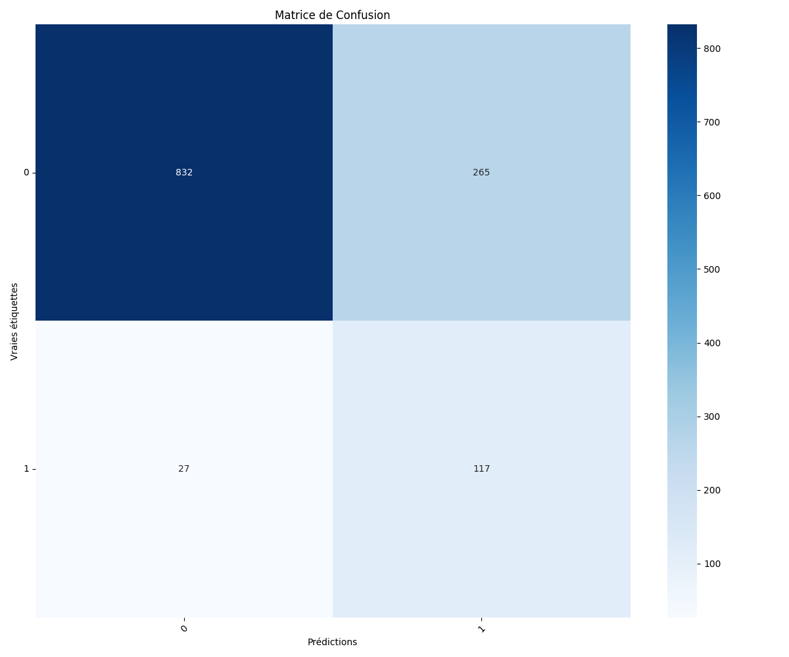

# Multi-Person Theft Detection 

This project focuses on detecting suspicious actions (theft) in supermarket videos using **pose estimation, tracking, and multi-person action recognition**. The system processes short video clips and outputs the predicted actions of each person present in the frame.

---

## Table of Contents

- [Overview](#overview)
- [Dataset](#dataset)
- [Methodology](#methodology)
  - [Keypoints Extraction](#keypoints-extraction)
  - [Frame Preprocessing](#frame-preprocessing)
  - [Person Tracking](#person-tracking)
  - [Action Classification](#action-classification)
- [Model Details](#model-details)
- [Inference](#inference)
- [Results](#results)
- [Requirements](#requirements)
- [Usage](#usage)
- [License](#license)

---

## Overview

The goal of this project is to detect potential theft activities in supermarket environments. The system uses **keypoints of human poses** to recognize actions for **all persons in a video**, even in crowded scenes.  

Key contributions include:  

1. **Robust keypoints extraction:** Handling missing joints using **joint relationships**.  
2. **Frame interpolation:** Ensuring consistent frame count per video (30 FPS, 1-second clips) using **padding, Kalman filter, or interpolation**.  
3. **Multi-person tracking:** Using **distance comparison, bounding box shapes, and Bot-SORT**.  
4. **Action recognition:** Two architectures used: **ST-GCNN with attention heads** and **CONTEXT-LSTM**, capable of handling multiple persons per frame.

---

## Dataset

- Videos are segmented into **1-second clips** (30 frames per clip).  
- Sometimes fewer than 30 frames are available; these are corrected with padding or interpolation.  
- Each person is annotated with **18 keypoints**. Missing keypoints are reconstructed based on relationships between joints.  
- FPS of the videos: **29**.

---

## Methodology

### Keypoints Extraction

- Pose estimation is performed using **YOLOPose**.  
- Original output: up to 18 keypoints per person.  
- Missing keypoints are reconstructed via **kinematic relationships** between joints.  

### Frame Preprocessing

- Videos are standardized to **30 frames per 1-second clip**.  
- Missing frames are corrected using:  
  - **Padding**  
  - **Kalman Filter**  
  - **Interpolation**

### Person Tracking

- Each person is tracked across frames using:  
  - **Distance between keypoints centers**  
  - **Bounding box shapes**  
  - **Bot-SORT tracker** for multi-person tracking  

### Action Classification

- Two models are trained to recognize **multi-person actions**:  
  1. **ST-GCNN with Attention Head**  
  2. **CONTEXT-LSTM**  
- These models output **action classes for all persons in each frame**.  

---

## Model Details

| Model                  | Type                   | Input Shape        | Notes                       |
|------------------------|-----------------------|-----------------|-----------------------------|
| ST-GCNN with Attention | Graph Convolutional    | Keypoints per frame | Multi-person, temporal modeling |
| CONTEXT-LSTM           | LSTM with Context      | Keypoints sequences | Attention mechanism included |

- Both models are designed to handle **crowded scenes with multiple people**.  
- Models operate at **~29 FPS**, suitable for real-time inference.

---

## Inference

- Load a video clip (1-second, 30 frames).  
- Extract keypoints via YOLOPose.  
- Track all persons using Bot-SORT.  
- Predict actions for each person using the **ST-GCNN** and **CONTEXT-LSTM** models.  

Example inference output:

